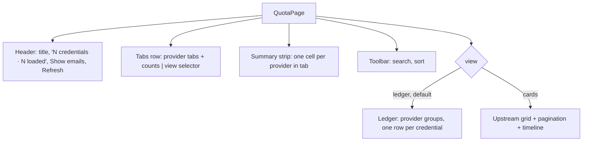
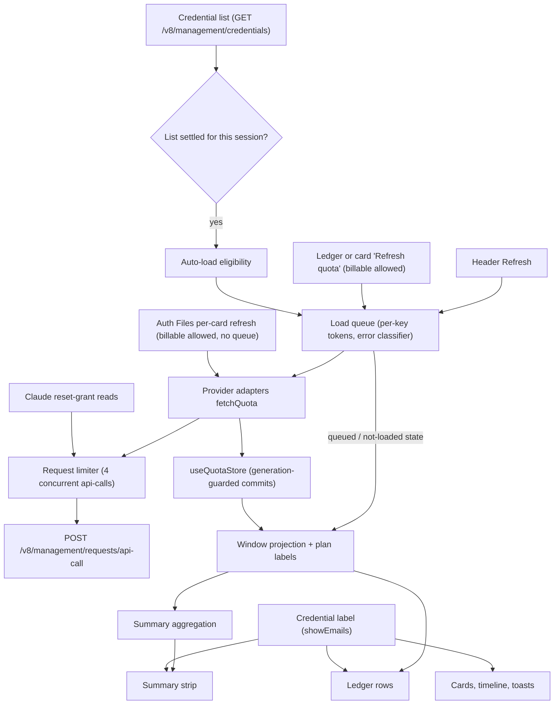
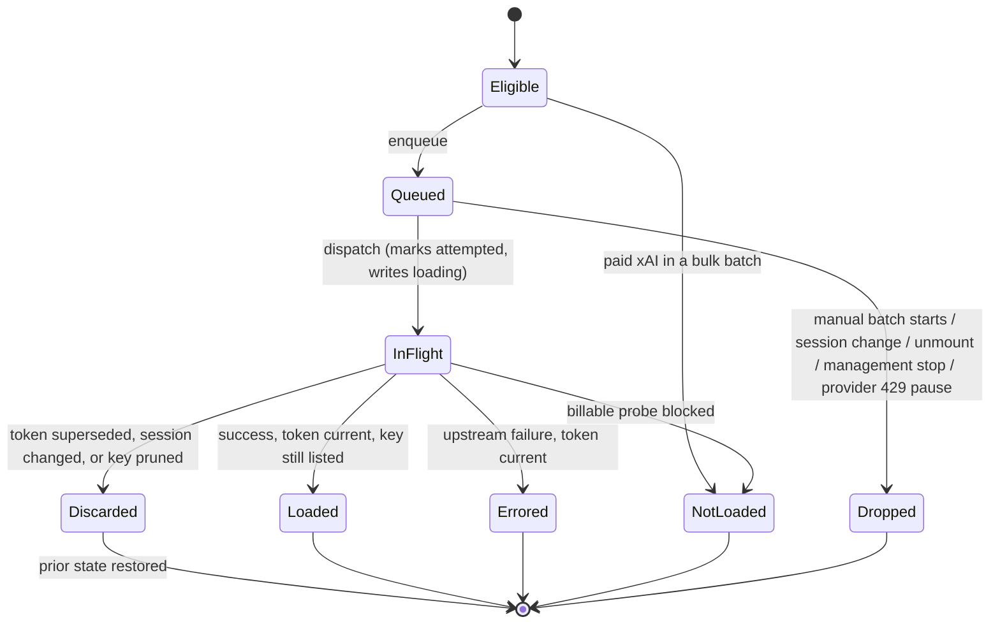
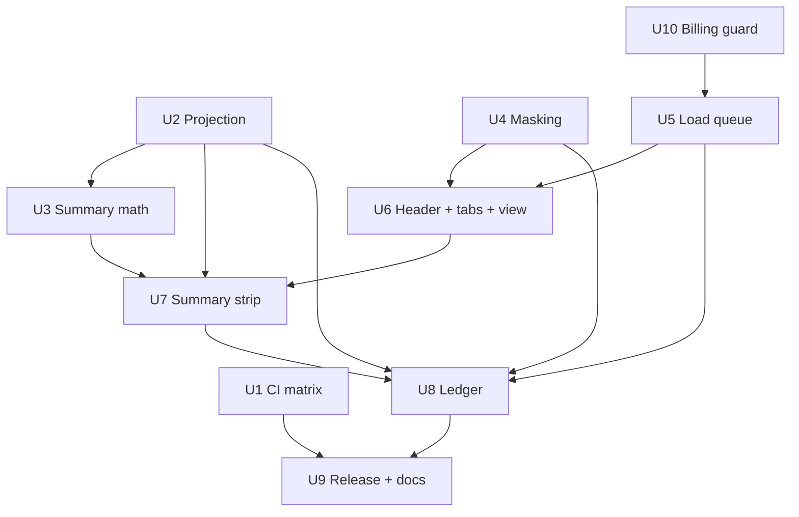

# Quota Ledger Dashboard - Plan

**Target repo:** a fork of `router-for-me/Cli-Proxy-API-Management-Center`. All paths are relative to the fork root unless prefixed with `CLIProxyAPI:` (the backend repo, consulted read-only per `AGENTS.md`).

## Goal Capsule

- **Objective:** Make the fork's Quota Management page (`#/quota`) replicate the target screenshot — header, provider tabs, provider summary strip, and Ledger view — with automatic, rate-safe quota loading and email masking, built and verified on Linux amd64 and macOS, and deployable to CLIProxyAPI hosts on both.
- **Authority, highest first:** the user's request and target screenshot; this Product Contract; the Planning Contract KTDs; `AGENTS.md`; existing code patterns. Where the screenshot conflicts with upstream behavior this plan preserves, the preserved behavior wins unless a KTD says otherwise.
- **Execution profile:** test-first for the pure modules (projection, summary, masking, queue, eligibility); characterization coverage before restructuring the batch loader; every UI unit verified in a browser against the screenshot.
- **Stop and ask when:** a backend or Management API contract change looks necessary; matching the screenshot would remove upstream functionality not listed in Scope Boundaries; macOS CI needs dependency version changes beyond regenerating platform bindings in `bun.lock`; or a provider's stored quota data cannot express a column the window spec requires.
- **Tail ownership:** the user creates and authenticates the GitHub fork, enables Actions, tags releases, and points CLIProxyAPI hosts at the fork. The executor stops at a green branch or PR inside the fork.

---

## Product Contract

### Summary

Rebuild the fork's quota page around a provider summary strip and a grouped Ledger list, matching the target screenshot, while keeping the upstream card grid as a selectable view.
Quota loads automatically for every eligible credential through a concurrency-limited queue that never sends billable requests in bulk.
Emails are masked by default behind a "Show emails" toggle.
CI proves the build on Linux amd64 and macOS, and the fork publishes its own `management.html` release that CLIProxyAPI can load on either OS.

### Problem Frame

Upstream's quota page shows a paginated grid of per-credential cards plus a timeline, and loads quota only when the user clicks Refresh (first page of 20 only).
With several credentials per provider, there is no at-a-glance answer to "how much capacity does each provider have left, and when does it come back?"
The target screenshot answers that with per-provider totals ("409% of 500%") and a dense one-row-per-credential ledger, and it shows filenames with emails masked, which matters when the dashboard is shared on screen.
The user runs CLIProxyAPI on Linux amd64 and works from macOS, so the fork must build on both and be loadable by the backend on both.

### Target Layout

The screenshot was supplied with the request and is not committed (it contains a third-party video overlay). This section is the authoritative description of it.

- **Header:** "Quota Management"; below it a mono line with a green accent bar reading "10 credentials · 10 loaded"; on the right a ghost "Show emails" button and a primary "Refresh" button with a refresh icon.
- **Tabs row:** All 10, Claude 5, Antigravity 0, Codex 3, xAI 1, Kimi 1, each with provider icon and count badge; a "Ledger" dropdown at the far right.
- **Summary strip:** one bordered strip with a cell per provider that has credentials. Example Claude cell: "Claude" with icon, "5 credentials" right-aligned and muted; "7-day Fable 5" label; "409%" large with "of 500%" muted; a bar of five segments (yellow, green, green, yellow, green); "in 1 day · 09/12, 23:00"; a divider; "7-day limit 454%" with a "Show" link. Other cells: Codex "Weekly limit 17% of 300%", xAI "Weekly limit -- of 100%", Kimi "Weekly limit 100% of 100%".
- **Ledger:** group heading "Claude 5"; each row has a mono masked filename (e.g. `claude-t•••@1•••.dev.json`) over a muted plan label ("Max"), then three window cells — "7-day Fable 5 58%", "5-hour limit 100%", "7-day limit 79%" — each with a thin bar and a reset line ("in 1 day · 09/13, 13:00" or "No reset pending"), and a "Refresh quota" ghost action on the right.

Sidebar and app shell in the screenshot already match upstream and are out of scope.

### Requirements

**Page header and navigation**

- R1. The header shows "Quota Management", the mono "N credentials · N loaded" line, a "Show emails" toggle, and a "Refresh" action.
- R2. Tabs always show All, Claude, Antigravity, Codex, xAI, and Kimi with counts, including zero; Devin and Meta tabs appear only when they have credentials.
- R3. A view selector at the right end of the tabs row switches between Ledger (default) and Cards, and the choice persists for the browser session.

**Summary strip**

- R4. Each provider in the current tab with at least one credential gets a summary card showing icon, name, credential count, primary window label, total remaining as "X% of Y%", a per-credential segmented bar, and the earliest upcoming reset.
- R5. Each card shows its secondary window total with a Show/Hide control that reveals the totals of the remaining windows.
- R6. Totals and segments distinguish credentials without data from credentials at 0%, and state how many credentials are reporting while some are missing.

**Ledger view**

- R7. Ledger groups credentials by provider in tab order, each group headed by provider name and count.
- R8. Each ledger row shows the credential label and plan, up to three window cells (label, remaining %, bar, reset line), an overflow control for extra windows, and a "Refresh quota" action.
- R9. Rows render distinct queued, loading, error, not-loaded, and loaded states.
- R10. Search filters ledger rows, and "Soonest recovery" sort orders rows within each group.

**Quota loading**

- R11. Quota loads automatically for every eligible credential once the credential list settles, through a concurrency-limited queue, with one automatic attempt per credential per visit.
- R12. Header Refresh refetches the credential list and refreshes every eligible credential, superseding queued automatic work, and stays enabled while loads run.
- R13. Bulk loads (automatic or header Refresh) never send a billable request; the paid xAI probe runs only from that credential's own "Refresh quota" action.
- R14. Existing guarantees hold: no quota request before the credential list succeeds, stale responses never write into a new session, deleted credentials leave no cached quota, and a management auth failure stops the queue while provider errors stay on their own rows.

**Privacy**

- R15. Emails in credential labels are masked by default on every quota-page surface — ledger, cards, timeline, tooltips, aria-labels, toasts, and error text — until "Show emails" is pressed, and the toggle resets to masked on each visit.

**Preservation**

- R16. The Cards view keeps upstream behavior: grid, 20-per-page pagination, timeline, Claude reset grants, and Codex reset credits.
- R17. All new user-facing text exists in `en`, `zh-CN`, `zh-TW`, and `ru`.

**Platform and delivery**

- R18. `bun install --frozen-lockfile` and `bun run verify` pass on Linux amd64 and macOS in CI.
- R19. The fork publishes a `management.html` release that CLIProxyAPI on macOS and Linux amd64 loads through `management.panel-github-repository`, with deployment steps documented.

### Acceptance Examples

- AE1. Claude totals
  - **Covers:** R4, R5, R6
  - **Given:** five loaded Claude credentials whose "7-day Fable 5" remaining values are 58, 100, 100, 51, 100.
  - **Then:** the card reads "409% of 500%", segments render medium, high, high, medium, high, the reset shown is the soonest of the five, and the secondary line sums their "7-day limit" values.
- AE2. Provider without percentages
  - **Covers:** R4, R6
  - **Given:** one xAI credential that loaded but reports no percentage.
  - **Then:** the card reads "-- of 100%" with one hatched no-data segment, and still shows a reset when one is known.
- AE3. Partial load
  - **Covers:** R6, R9
  - **Given:** five Claude credentials, two loaded at 80 and 60, two queued, one errored.
  - **Then:** the card reads "140% of 500%" with "2/5 reporting" and three hatched segments, and the errored credential never counts as 0%.
- AE4. Window absent from a plan
  - **Covers:** R4, R8
  - **Given:** five loaded Claude credentials, one of which has no Fable window.
  - **Then:** the Fable total reads "of 400%" with four segments, and that credential's ledger cell shows "—".
- AE5. Masking
  - **Covers:** R15
  - **Given:** a credential named `claude-tom@1abc.dev.json` with backend email `tom@1abc.dev`.
  - **Then:** every surface shows `claude-t•••@1•••.dev.json`; pressing "Show emails" reveals the full name; leaving and returning to the page masks it again.
- AE6. Paid xAI
  - **Covers:** R11, R13
  - **Given:** a paid xAI credential when the page opens.
  - **Then:** no request is sent for it, its row reads "Not loaded", header Refresh also skips it, and its own "Refresh quota" sends the probe and loads it.
- AE7. Hidden tab fallback
  - **Covers:** R2
  - **Given:** the stored tab is Devin and no Devin credentials exist.
  - **Then:** All becomes active once the list settles, and the stored value is left unchanged.
- AE8. Session switch mid-load
  - **Covers:** R14
  - **Given:** auto-load is running and the user switches connection.
  - **Then:** queued requests never dispatch, in-flight results are discarded, and the new connection auto-loads its own list.
- AE9. Manual supersede
  - **Covers:** R12
  - **Given:** auto-load has 12 queued and 4 in-flight requests and the user clicks Refresh.
  - **Then:** the list refetches, the 4 in-flight requests are adopted without duplicates, and the remaining credentials re-queue under the manual batch.
- AE10. Upstream rate limit
  - **Covers:** R11
  - **Given:** a Codex quota request returns 429.
  - **Then:** the remaining queued Codex credentials in that batch stay not loaded while other providers continue.
- AE11. Management auth failure
  - **Covers:** R14
  - **Given:** the management key stops working mid-queue.
  - **Then:** a management 401 hands off to the app's existing logout, which invalidates the session; a management 403 (IP ban) or a network failure stops the queue and shows one page banner instead of per-row errors.
- AE12. Provider auth failure
  - **Covers:** R9, R14
  - **Given:** one Claude credential's upstream token has expired, so its quota call returns an upstream 401.
  - **Then:** only that row shows an error and the queue keeps loading the other credentials.

### Scope Boundaries

- Sidebar, app shell, and pages other than `#/quota` stay as upstream has them.
- No backend changes and no new Management API endpoints.
- No native desktop app, binary, or installer packaging; the deliverable stays a single `management.html`.
- Ledger rows do not show Claude reset grants or Codex reset credits; the Cards view keeps both.
- The frozen plan-badge styles in `src/features/quota/components/QuotaBody.module.scss` (from the plan-badge block to end of file) stay untouched.

#### Deferred to Follow-Up Work

- A POSIX install script for hosts that disable panel auto-update.
- An Intel macOS CI runner (the matrix covers Apple Silicon only).
- Automatic reload when a credential's reset instant passes.
- Plural-aware count strings for `ru` (existing quota strings are non-plural; this plan follows that precedent).
- Clicking a summary card to select its provider tab.
- Proposing the changes upstream as a PR.

### Sources

- Upstream quota feature: `src/features/quota/QuotaPage.tsx`, `src/features/quota/hooks/useQuotaBatchLoader.ts`, `src/features/quota/quotaTimelineModel.ts`, `src/features/quota/resetSchedule.ts`, `src/features/quota/providers/*/data.ts`, `src/types/quota.ts`.
- Identity red lines: `src/features/authFiles/identity.ts` (never read `account`; never regex-extract emails from filenames).
- Billable xAI probe: `src/features/quota/providers/xai/data.ts` (`requestXaiPaidHealth` posts a real chat completion; `fetchXaiQuota` falls back to it when free billing fails).
- Panel delivery: `CLIProxyAPI:internal/managementasset/updater.go`, `CLIProxyAPI:internal/api/server_management.go`, `CLIProxyAPI:config.example.yaml`.
- Management API: `CLIProxyAPI:docs/management-api-v8.md` (`GET /v8/management/credentials`, `POST /v8/management/requests/api-call`); auth ban in `CLIProxyAPI:internal/api/handlers/management/handler.go`.

---

## Planning Contract

### Key Technical Decisions

- KTD-1. **Add a display projection, not a normalized quota model.** A pure module reads each provider's stored state structurally and emits, per credential, window cells (window id, label, remaining or null, reset instant or null, load status) plus a plan label. Stores, fetchers, and card bodies keep their shapes. `quotaTimelineModel.ts` and `resetSchedule.ts` deliberately avoid a normalized model; a presentation-only projection respects that while giving the ledger and strip one source.
- KTD-2. **One per-provider window spec, keyed by window id.** The spec names ledger columns, summary primary and secondary windows, and overflow (table below). It never keys on translated labels or period lengths, because labels are translated at fetch time and periods vary by plan.
- KTD-3. **Remaining-percent math everywhere.** Each provider normalizes to remaining percent clamped to 0–100. Displayed values and totals use the integer-rounded value, so the strip always equals the visible arithmetic (58+100+100+51+100 = 409). The denominator is 100 × the credentials where the window applies or is still unknown; loaded credentials without the window are excluded; the numerator is "--" when none report. xAI cards say "Used N%", but ledger and strip show remaining to match the screenshot. Kimi follows its card body: zero limit with zero use is no data, zero limit with any use is 0.
- KTD-4. **Share one level helper, fed the unrounded value.** The 70/30 thresholds move out of `QuotaMeter.tsx` into `src/features/quota/level.ts`, used by `QuotaMeter`, ledger bars, and strip segments. Every view levels the unrounded value, because card bodies pass unrounded values to `QuotaMeter` today; leveling a rounded value would color 69.5–69.99 differently in Cards and Ledger. The helper takes numbers only; `QuotaMeter` keeps its own mapping of missing data to the medium fill, which the Auth Files page relies on.
- KTD-5. **Turn the existing batch loader into a page-owned queue that limits requests, not tasks.**
  - **Limit:** at most 4 concurrent `api-call` requests, below the browser's 6 connections per origin. Claude, Codex, xAI, and Antigravity each send two calls per credential, so a task-level cap would exceed the budget. The limiter is a rate-limited `request` injected through the fetch options bag, following `createDevinQuotaFetcher({ request })` in `src/features/quota/providers/devin/requests.ts` and the injected request in `src/features/quota/providers/meta/data.ts`. Enrichment and Claude reset-grant reads use the same limiter.
  - **Item state:** "loading" is written at dispatch, while queued items live in loader memory. Per-key request tokens stop older responses from overwriting newer ones. The per-file cache generation is captured per item at dispatch, because `src/features/authFiles/cacheInvalidation.ts` bumps it per file.
  - **Attempts:** a credential counts as attempted when it dispatches, and gets one automatic attempt per session and file generation.
  - **Results:** a result commits only if its key is still in the live credential list, because pruning deletes keys without bumping a generation. A discarded result restores the row's prior state, so nothing is left stuck in "loading". In-flight results still commit under the generation guards after the page unmounts.
  - **Manual Refresh:** it cancels automatic work only once its batch actually starts after a successful list refetch, then adopts in-flight keys. If the list refetch fails, the automatic queue keeps running.
  - **Errors** are sorted by source. Management failures arrive as `ApiError` from `src/services/api/client.ts`; upstream failures arrive as status errors from each provider's `createStatusError`.
    - Management 401: defer to the existing logout and generation bump.
    - Management 403 or network failure: stop the queue and show one page banner.
    - Upstream 429: pause that provider for the batch.
    - Any other upstream error: error on that row only.
  - **Row actions:** blocked while their key is queued or in flight. Codex reset takes the key's token.
  - **Global refresh:** the app-shell refresh keeps upstream behavior (refetch the list only); auto-load then covers newly added credentials.
  - **Devin:** its separate auto-load hook is removed, because the unified loader covers Devin and would otherwise fetch it twice.
  - **Rejected alternatives:**
    - A module-level scheduler shared by every writer, like Devin's request pool. A page-owned queue drops queued work on unmount for free and changes nothing outside `#/quota`; its tokens cover only writes that go through it.
    - A second loader. The existing `loadingRef` silently drops overlapping batches.
- KTD-6. **Guard billing with a required fetch option.** The options parameter becomes required on `QuotaProviderData` and `QuotaAdapter` so the compiler flags every caller: the batch loader, `useQuotaActions`, and `src/features/authFiles/components/AuthFileQuotaSection.tsx`. At runtime it defaults to non-billable, because tests are not type-checked. Only per-credential actions allow billable probes: the quota page's "Refresh quota" (ledger and cards) and the Auth Files page's per-card refresh, which keeps today's behavior. Bulk paths skip credentials flagged paid and suppress the free-to-paid fallback, so a misdetected paid account still cannot trigger the probe. A blocked probe returns a typed outcome that the loader shows as "Not loaded", not as an error. This deliberately changes upstream's refresh-all, which would ping paid xAI accounts on the current page. Rejected alternative: a separate bulk-safe entry point that leaves `fetchQuota` billable. It touches fewer files, but every new caller would bill by default.
- KTD-7. **Mask from the backend email, over-mask the rest.**
  - **Algorithm:** one label helper takes the whole entry, so it can read `file.email`. It replaces occurrences of the backend email (case-insensitive, treating `@`, `.`, `_` as interchangeable) with a masked form that keeps the first character of the local part, the first character of the domain label, and the TLD. It then masks any remaining email-shaped token.
  - **Red lines:** this respects the identity rules, because masking hides text and never derives an identity. It never reads `account`. If two labels collide after masking, it appends the auth index.
  - **Not a security boundary:** masking is display privacy only; search still matches raw values.
  - **Toggle:** in-memory page state, so every visit starts masked.
  - **Rejected alternatives:**
    - Opaque aliases cannot leak, but nobody can tell credentials apart.
    - CSS blur leaves raw emails in the DOM, aria-labels, tooltips, and toasts.
- KTD-8. **Ledger is the default view; Cards keeps the upstream grid.** The view selector (the shared `Select`) sits after the scrolling tab strip at the right end of the tabs row. The summary strip renders in both views and covers the whole current tab, ignoring search and pagination. The search-and-sort toolbar moves below the strip so the top of the page matches the screenshot. `view` persists in the existing session-scoped `uiState` with a validator; the page applies the Ledger default so the reader's round-trip test stays valid. Rejected alternative: show the strip and move the toolbar only in Ledger. It would keep the Cards top identical to upstream, at the cost of a page top that jumps when switching views.
- KTD-9. **Always show the six core tabs (All, Claude, Antigravity, Codex, xAI, Kimi); show Devin and Meta only when non-empty.** This matches the screenshot ("Antigravity 0" shown, no Devin/Meta) without hiding credentials users have. Filtering happens at the page's tab-id list, so `buildTabCounts` and its pinned test stay unchanged and `ProviderTabs`, shared with the Auth Files page, is not modified. A stored tab that becomes hidden falls back to All once the list settles, without rewriting storage.
- KTD-10. **New components own their stylesheets and take class maps as props.** Under `bun test` an SCSS import is a string, and `bindQuotaClasses` throws at module init, which is why `QuotaCard` cannot be imported in tests. New components accept classes as props so they render in `renderToStaticMarkup` tests. `QuotaClassMap` is not extended, because every new key would also have to land in the Auth Files stylesheet or the app white-screens.
- KTD-11. **Hold soonest-first order steady during loads.** Rows do not reorder while a batch runs; soonest order is recomputed when the batch drains. Minute ticks stay inside countdown components and never feed loader effect dependencies.
- KTD-12. **Keep the fork rebase-friendly.** New behavior lives in new files; edits to `QuotaPage.tsx` stay at the wiring level through hooks; the deployment guide is a new file instead of a README rewrite. Upstream changes `src/features/quota/` often, so this keeps conflicts small.
- KTD-13. **Prove cross-platform support with a CI matrix and a platform-neutral artifact.** CI runs the existing verify gate on `ubuntu-latest` (x86_64) and `macos-latest` (Apple Silicon) with fail-fast off. The release workflow stays a single Ubuntu build, because `management.html` is identical on every OS and the backend downloads it on both. Tests must derive date and time expectations from the same formatters rather than literals, because ICU data and time zones can differ between runners.

### High-Level Technical Design

#### Page composition

#### Data flow

#### Queue item lifecycle

Errored credentials are not retried automatically within the same visit; header Refresh or the row action retries them. A management 403 or network failure moves every queued item to Dropped and raises the page banner.

#### Per-provider window spec

| Provider | Ledger columns, in order | Summary primary | Summary secondary | Overflow |
|---|---|---|---|---|
| Claude | `seven-day-fable`, `five-hour`, `seven-day` | `seven-day-fable`; `seven-day` when no credential reports Fable | `seven-day`; `five-hour` when primary is `seven-day` | `seven-day-opus`, `seven-day-sonnet`, `seven-day-oauth-apps`, `seven-day-cowork` |
| Codex | `five-hour`, then `weekly` or `monthly` | `weekly`, or `monthly` for plans that report it | `five-hour` | `code-review-*`, per-model windows |
| xAI | `xai:weekly`, or the monthly billing cycle | weekly, falling back to monthly | none | none |
| Kimi | `summary` (weekly), first `limit-N`, `monthly` | `summary` | `monthly` | further `limit-N` rows |
| Antigravity | up to three quota groups, each showing its most-constrained bucket | per credential, the lowest weekly bucket (lowest bucket if none weekly) | per credential, the lowest 5h bucket | remaining groups |
| Devin | `daily`, `weekly` | `weekly` | `daily` | none |
| Meta | `window`, `weekly` | `weekly` | `window` | none |

Column labels reuse each provider's existing translated labels so ledger, strip, and cards agree.

#### Unit dependencies

U1, U2, U4, and U10 have no prerequisites and can land in any order; U5 follows U10. U1 lands first to surface macOS toolchain issues early.

### System-Wide Impact

- **Upstream provider load:** auto-load raises quota calls per page visit from zero to two or three per eligible credential, all from the backend host's IP. The request limiter, cache reuse across navigation, one automatic attempt per visit, and the 429 pause bound it.
- **Billing:** bulk paths never send the billable xAI probe, including the Cards view's header refresh, which previously did.
- **Privacy:** masking defaults on across quota surfaces; it is display-only, and search still matches raw values.
- **Auth Files page:**
  - `src/features/authFiles/components/AuthFileQuotaSection.tsx` calls `fetchQuota` directly and must pass billable-allowed to keep its per-card paid probe.
  - It renders every provider body, so the level-helper and plan-label extractions must produce identical output, including missing data mapping to the medium fill.
  - It treats a "loading" status as a lock, so the queue must never leave a key stuck in "loading".
  - `ProviderTabs` (also used by `src/features/authFiles/AuthFilesPage.tsx`) is not modified.
- **Session lifecycle:**
  - `src/stores/useAuthStore.ts` clears the quota cache on login and logout.
  - `src/services/api/client.ts` fires `unauthorized` on 401 only.
  - `src/features/authFiles/cacheInvalidation.ts` bumps per-file generations.
  - The queue relies on all three and adds dispatch-time checks rather than replacing the existing guards.
- **Failure propagation:** management failures surface once as a page banner or logout; upstream failures stay on their rows; list-refetch failures leave cached rows visible behind the existing error banner.

### Risks & Dependencies

| Risk | Mitigation |
|---|---|
| Upstream keeps changing `src/features/quota/`, causing rebase conflicts | KTD-12: new files, thin page wiring, frequent rebases from an `upstream` remote |
| macOS install or tests fail: missing native bindings for Vite 8 / rolldown in `bun.lock`, or ICU- and TZ-sensitive date assertions | U1 lands first; regenerate platform bindings in `bun.lock` on macOS with identical versions if needed; make date expectations formatter-derived |
| Provider 429s or blocks from auto-load | Concurrency 4, per-provider pause on 429, one automatic attempt per visit |
| Management auth ban: 5 failed key attempts from one IP block it for 30 minutes, and up to 4 in-flight requests can fail before the first failure returns | Quota fan-out only after the credential list succeeds; the 4-request cap keeps one wave below the threshold; the queue stops on the first management failure |
| `tsconfig.json` covers `src` only, so the required fetch option is not type-checked in `tests/` | Run the full test suite after U10; existing tests that call `fetchQuota(file, t)` are updated explicitly |
| Paid-xAI detection (`isPaidXaiAuthFile`) is heuristic | Bulk paths suppress the billable fallback regardless of detection (KTD-6) |
| Backend silently falls back to the upstream panel when the fork URL is malformed, the fork is private, or no Latest release exists | Deployment guide documents accepted URL forms and requirements; verification checks the footer's Management UI version |
| No GitHub auth on the planning machine, so the fork does not exist yet | User runs `gh auth login` and creates the fork before execution starts |

### Rollout Notes

- Create the fork under the user's GitHub account, keep it public (the backend downloads release assets without auth), and enable Actions in the fork, which forks disable by default.
- Clone the fork with `origin` pointing at it and an `upstream` remote pointing at `router-for-me/Cli-Proxy-API-Management-Center`; develop on a feature branch.
- After the feature lands, tag a version with a fork suffix (for example `v1.26.0-rva.1`); the existing release workflow builds and uploads `management.html` as a non-draft, non-prerelease Latest release, and GitHub attaches a sha256 digest the backend verifies.
- On each CLIProxyAPI host, set `management.panel-github-repository` to the fork URL; the backend checks at startup and every 3 hours, so delete the cached `static/management.html` and reload `/management.html`, or restart, to apply immediately.

### Deferred to Implementation

- Antigravity group columns: the spec picks each group's most-constrained bucket; confirm the group set and labels against live data while building U2 and U8.

---

## Implementation Units

### U1. Cross-platform CI matrix

- **Goal:** Prove the existing toolchain on Linux amd64 and macOS before feature work begins.
- **Requirements:** R18
- **Dependencies:** none
- **Files:**
  - Modify: `.github/workflows/ci.yml`
  - Create: `tests/ciPlatformMatrix.test.ts`
- **Approach:** Run the existing verify job as a matrix over `ubuntu-latest` and `macos-latest` with fail-fast off, keeping Node 24 and Bun 1.3.14. Leave `release.yml` on Ubuntu (KTD-13). If an existing test fails only on macOS because of ICU or time-zone formatting, fix the test so it derives expectations from the formatter; do not change product code to suit a runner.
- **Execution note:** Land first. Treat a macOS-only failure as a toolchain finding (lockfile bindings or a locale-sensitive test), never as grounds to drop macOS.
- **Patterns to follow:** source/contract tests that read repo files, such as `tests/quotaToolbar.test.ts`.
- **Test scenarios:**
  - The workflow matrix lists both `ubuntu-latest` and `macos-latest`.
  - Fail-fast is disabled so both results report.
  - Each matrix job installs with `bun install --frozen-lockfile` and runs `bun run verify`.
- **Verification:** both matrix jobs pass on a pull request in the fork.

### U2. Window projection, level helper, and plan labels

- **Goal:** One pure source of per-credential window cells and plan labels for the ledger and strip.
- **Requirements:** R4, R5, R8, R16
- **Dependencies:** none
- **Files:**
  - Create: `src/features/quota/windowSpecs.ts`, `src/features/quota/windowProjection.ts`, `src/features/quota/planLabels.ts`, `src/features/quota/level.ts`, `src/features/quota/providers/antigravity/labels.ts`
  - Modify: `src/features/quota/components/QuotaMeter.tsx`, `src/features/quota/providers/claude/ClaudeQuotaBody.tsx`, `src/features/quota/providers/codex/CodexQuotaBody.tsx`, `src/features/quota/providers/xai/XaiQuotaBody.tsx`, `src/features/quota/providers/antigravity/AntigravityQuotaBody.tsx`
  - Test: `tests/quotaWindowProjection.test.ts`, `tests/quotaPlanLabels.test.ts`, `tests/quotaLevel.test.ts`
- **Approach:**
  - **Projection:** implement the spec table from the High-Level Technical Design and a projection with one structural branch per provider, `now` injected, and no React or SCSS imports (KTD-1, KTD-2).
  - **Normalization** per KTD-3:
    - Claude, Codex, xAI, and Meta convert used to remaining.
    - Antigravity multiplies its fraction by 100.
    - Devin passes through.
    - Kimi follows its card body.
    - Meta reset seconds become milliseconds.
    - Reuse `XAI_WEEKLY_ROW_ID` from `resetSchedule.ts`.
  - **Labels:** move plan-label logic out of the card bodies into `planLabels.ts`, and Antigravity's group and bucket label map into `providers/antigravity/labels.ts`. The bodies call the shared helpers so cards and ledger agree.
  - **Level helper:** extract the 70/30 helper from `QuotaMeter` (KTD-4).
- **Execution note:** Characterize the current level boundaries and plan labels before extracting them; implement the projection test-first.
- **Patterns to follow:** `src/features/quota/quotaTimelineModel.ts` (structural per-provider reads; its private remaining-percent math is the closest precedent), `src/features/quota/resetSchedule.ts`, `src/features/quota/providers/antigravity/countdown.ts` (provider-local helper placement), fixtures in `tests/quotaTimeline.test.ts`, identity `t` in `tests/claudeFableQuota.test.ts`.
- **Test scenarios:**
  - Claude with five-hour used 0, seven-day used 21, Fable used 42 yields columns Fable 58, 5-hour 100, 7-day 79, in that order.
  - Claude five-hour without a reset instant yields a null reset, which renders "No reset pending" later.
  - Claude opus and sonnet windows land in overflow, not columns.
  - Claude with a null used percent yields a null remaining, never 100.
  - Codex picks whichever of weekly or monthly exists for the second column; code-review windows go to overflow.
  - Codex with limit reached and no percentage (stored as used 100) yields remaining 0.
  - xAI weekly usage 30 yields remaining 70; paid-health mode yields no percentage cells but keeps the plan label.
  - Kimi weekly row 20 used of 100 yields 80; limit 0 with used 5 yields 0; limit 0 with used 0 yields null; a relative-only reset hint yields a null instant.
  - Antigravity groups with buckets at 0.4 and 0.9 yield a group cell of 40, labeled the same as the card body.
  - Devin remaining passes through; Meta reset seconds convert to milliseconds.
  - Values of −5 and 140 clamp to 0 and 100; fractional values round to integers.
  - Idle, loading, and error states yield cells with that status and null values.
  - The level helper matches today's `QuotaMeter` boundaries exactly at 70, 69.99, 69, 30, 29.99, and 29.
  - `QuotaMeter` still renders the medium fill for missing data.
  - Plan labels: Claude `max` yields "Max"; Codex reads the id-token plan; xAI (including "SuperGrok Heavy") and Antigravity resolve as their bodies do today; unknown yields null.
  - These suites pass unchanged: `tests/quotaBodyRendering.test.ts`, `tests/claudeFableQuota.test.ts`, `tests/xaiQuotaUnavailable.test.ts`, `tests/metaQuotaUi.test.ts`, `tests/devinQuotaUi.test.ts`, `tests/quotaResetSchedule.test.ts`, `tests/quotaClassContract.test.ts`.
- **Verification:** the new tests pass, and the Cards view and the Auth Files quota sections (`#/auth-files`) render identically to before.

### U3. Summary aggregation

- **Goal:** Compute each provider's strip data from projected cells.
- **Requirements:** R4, R5, R6
- **Dependencies:** U2
- **Files:**
  - Create: `src/features/quota/summary.ts`
  - Test: `tests/quotaSummary.test.ts`
- **Approach:** Pure function over the projected cells of the current tab's entries, the spec, and `now`. Per provider it returns the credential count, the reporting count, and, for primary, secondary, and revealable windows: label, total or null, denominator, ordered segments (level or no-data), and earliest future reset. Apply KTD-3's math. Segments follow ledger row order. Above 40 credentials, return banded proportions per level instead of individual segments. Omit providers with no entries.
- **Execution note:** Test-first; the Acceptance Examples are the fixtures.
- **Patterns to follow:** pure-logic suites such as `tests/quotaPageLogic.test.ts`.
- **Test scenarios:**
  - Covers AE1. Five Claude credentials at 58, 100, 100, 51, 100 total 409 of 500 with segments medium, high, high, medium, high.
  - Covers AE2. One xAI credential with no percentage yields a null total over 100 and one no-data segment.
  - Covers AE3. Two loaded at 80 and 60, two queued, one errored yields 140 of 500, reporting 2 of 5, three no-data segments.
  - Covers AE4. One loaded credential without Fable shrinks the Fable denominator to 400 with four segments.
  - Earliest reset ignores instants before `now`; when all are past it is null.
  - Totals sum the rounded per-row values, not raw fractions.
  - With no Fable anywhere, primary falls back to 7-day and secondary to 5-hour.
  - Forty-one credentials switch to banded proportions.
  - A tab with no entries yields no providers.
- **Verification:** the screenshot's numbers (409/500, 454, 17/300, --/100, 100/100) reproduce from fixtures.

### U4. Credential label masking

- **Goal:** Mask emails on every quota-page surface by default.
- **Requirements:** R15
- **Dependencies:** none
- **Files:**
  - Create: `src/features/quota/credentialLabel.ts`
  - Modify: `src/features/quota/QuotaPage.tsx`, `src/features/quota/components/QuotaCard.tsx`, `src/features/quota/components/QuotaTimeline.tsx`, `src/features/quota/hooks/useQuotaActions.ts`, `src/features/quota/providers/claude/ClaudeResetGrants.tsx`
  - Test: `tests/quotaCredentialLabel.test.ts`, `tests/quotaTimelineRendering.test.ts`
- **Approach:** Implement KTD-7.
  - **State:** hold `showEmails` as in-memory page state, defaulting to masked.
  - **Timeline:** change the page's `displayNameFor` to take the entry instead of the filename, so it can read `file.email`. Route Devin lanes in `QuotaTimeline` through it; they currently bypass it via `getQuotaDisplayName` from `src/utils/quota/identity.ts`.
  - **Cards:** give `QuotaCard` a display-label prop for the name and `title` it currently derives from `getQuotaDisplayName`.
  - **Messages:** route toasts, the Claude reset-grant confirmation (which interpolates the raw `file.name`), and any upstream error text shown in rows through the same masker.
  - **Unchanged:** `getQuotaDisplayName` keeps its contract, so `tests/devinQuotaIdentity.test.ts` stays valid. The search haystack stays on raw values.
- **Execution note:** Test-first for the label helper.
- **Patterns to follow:** the red lines in `src/features/authFiles/identity.ts`; `maskApiKey` in `src/utils/format.ts`.
- **Test scenarios:**
  - Covers AE5. `claude-tom@1abc.dev.json` with email `tom@1abc.dev` yields `claude-t•••@1•••.dev.json`; with `showEmails` it is unchanged.
  - Uppercase email characters in the filename still mask.
  - A filename encoding `@` as `_` (`claude-tom_1abc.dev.json`) still masks.
  - `codex-abc12345-first-last@example.com-team.json` with its backend email masks only the email; prefix, hash, and plan stay visible.
  - A name containing an email-shaped token without a backend email masks via the fallback.
  - A name with no email (Kimi) is unchanged.
  - A populated `account` field never appears in output.
  - Two labels that collide after masking gain auth-index suffixes.
  - Devin's "name · email" masks both parts.
  - An error message containing the email is masked.
  - `tests/quotaTimelineRendering.test.ts` passes with the entry-based `displayNameFor`, and Devin lanes render masked labels.
  - `tests/claudeResetGrants.test.ts` stays green, including its `{{name}}` locale requirement.
- **Verification:** with emails hidden, no raw email appears in cards, timeline, tooltips, toasts, confirmations, or row errors in the browser.

### U5. Concurrency-limited load queue and auto-load

- **Goal:** Load every eligible credential automatically and safely, and make header Refresh cover all credentials.
- **Requirements:** R11, R12, R14
- **Dependencies:** U10
- **Files:**
  - Create: `src/features/quota/loadQueue.ts`, `src/features/quota/autoLoad.ts`, `src/features/quota/quotaErrors.ts`, `src/features/quota/hooks/useQuotaAutoLoad.ts`
  - Modify: `src/features/quota/hooks/useQuotaBatchLoader.ts`, `src/features/quota/hooks/useQuotaActions.ts`, `src/features/quota/quotaEnrichment.ts`, `src/features/quota/components/QuotaCard.tsx`, `src/features/quota/constants.ts`, `src/features/quota/QuotaPage.tsx`
  - Delete: `src/features/quota/providers/devin/useDevinQuotaAutoLoad.ts`
  - Test: `tests/quotaLoadQueue.test.ts`, `tests/quotaAutoLoad.test.ts`, `tests/quotaErrors.test.ts`, `tests/xaiQuotaEnrichment.test.ts`, `tests/quotaPageLogic.test.ts`
- **Approach:** Implement KTD-5.
  - **Scheduler:** a pure module owning task priority, cancellation, per-key tokens, and the request limiter handed to fetchers through the U10 options bag. It is page-owned, so unmount stops dispatching.
  - **Error classifier:** a pure module sorting failures into management-auth, management-stop, upstream-rate-limit, and upstream-row classes. `ApiError` from the management client and status errors from provider fetchers are the discriminator.
  - **Eligibility:** a pure module defining "settled" as not loading, no list error, file generation equal to the session generation, and connected.
    - Automatic triggers select idle credentials not yet attempted this session and generation.
    - Header Refresh selects every credential, including loaded and errored ones, and adopts in-flight requests once its list refetch succeeds.
    - Both bulk triggers exclude disabled and paid xAI credentials.
  - **Priority:** visible entries (current tab, page, and search) dispatch first. Tab, search, or view changes reprioritize without cancelling.
  - **Refetches:** credentials that appear after a refetch get their attempt. Vanished keys drop. Commits check that the key is still listed.
  - **Dispatch checks:** before every dispatch, check session, connection, and the per-file generation.
  - **Scope:** header Refresh targets all eligible entries rather than the current page, so pagination stays a display concern of the Cards view while `QUOTA_PAGE_SIZE` stays 20.
  - **Card view:** `QuotaCard` mounts Claude reset grants only after a successful load; their reads go through the limiter.
  - **Enrichment:** keep the `enrichQuotaInBackground` signature or update `tests/xaiQuotaEnrichment.test.ts` with it.
- **Execution note:** Extract the batch loader's session-isolation and stale-response guards into the pure scheduler first and characterize them there, since the repo has no hook test harness. Then build eligibility and the classifier test-first with fake fetchers. Hook wiring is verified in the browser.
- **Patterns to follow:** guards in `src/features/quota/hooks/useQuotaBatchLoader.ts`; the per-session pool, pre-dispatch generation check, and in-flight dedupe in `createDevinQuotaFetcher` (`src/features/quota/providers/devin/requests.ts`); `createLogRequestQueue` in `src/features/logs/model/logRequests.ts`; the attempted-set keying in the removed Devin hook; `captureQuotaCacheGeneration` and `commitIfQuotaCacheCurrent` in `src/stores/useQuotaStore.ts`.
- **Test scenarios:**
  - Ten credentials whose fetchers each issue two requests never exceed four concurrent requests, and all complete in priority order.
  - Promoting a queued key dispatches it next.
  - Cancelling drops queued tasks while in-flight tasks finish; results under a superseded token do not commit and restore the row's prior state.
  - An older response for a key arriving after a newer request for the same key does not commit.
  - A per-file generation bump between enqueue and dispatch, or between dispatch and response, prevents the commit.
  - A late result for a key pruned from the list does not recreate it.
  - After unmount, an in-flight result still commits under the generation guard, and no key is left in "loading".
  - Covers AE6. Automatic eligibility includes idle entries and excludes disabled, loaded, loading, already-attempted, and paid xAI entries.
  - Header Refresh eligibility includes loaded and errored entries and still excludes disabled and paid xAI entries.
  - Nothing is eligible while the list is loading, errored, generation-mismatched, or disconnected.
  - A credential counts as attempted at dispatch; one cancelled while queued stays eligible.
  - Covers AE8. A session change mid-queue stops further dispatches, and in-flight results do not commit.
  - Covers AE9. A manual batch adopts in-flight keys without duplicate requests and re-queues the rest; if its list refetch fails, the automatic queue keeps running.
  - Covers AE10. An upstream 429 pauses only that provider for the batch.
  - Covers AE11. A management 403 or a network failure without a response stops the queue, writes no row errors, and raises one banner; a management 401 defers to logout.
  - Covers AE12. An upstream 401 errors only its row and the queue continues.
  - Row actions and Codex reset are blocked while their key is queued or in flight.
  - An errored credential is not retried automatically in the same visit, and header Refresh retries it.
  - A Devin credential is fetched exactly once per visit.
  - These suites stay green: `tests/quotaSessionIsolation.test.ts`, `tests/quotaPageLogic.test.ts` (including `QUOTA_PAGE_SIZE === 20` and `canRefreshQuotaAfterList`), `tests/xaiQuotaEnrichment.test.ts`, `tests/claudeResetGrants.test.ts`.
- **Verification:** in the browser, opening the page with about 10 credentials shows at most four concurrent `api-call` requests (reset-grant reads included), no request for paid xAI, and one fetch per Devin credential.

### U6. Header, tabs row, toolbar placement, and view state

- **Goal:** Page chrome matches the screenshot.
- **Requirements:** R1, R2, R3, R12, R15, R17
- **Dependencies:** U4, U5
- **Files:**
  - Modify: `src/features/quota/components/QuotaHeader.tsx`, `src/features/quota/components/QuotaHeader.module.scss`, `src/features/quota/QuotaPage.tsx`, `src/features/quota/QuotaPage.module.scss`, `src/features/quota/constants.ts`, `src/features/quota/uiState.ts`, `src/features/quota/logic.ts`, `src/i18n/locales/en.json`, `src/i18n/locales/zh-CN.json`, `src/i18n/locales/zh-TW.json`, `src/i18n/locales/ru.json`
  - Test (modify): `tests/quotaUiState.test.ts`, `tests/quotaPageLogic.test.ts`
  - Test (create): `tests/quotaHeaderRendering.test.ts`, `tests/quotaLocaleParity.test.ts`
- **Approach:**
  - **Header:** add a ghost "Show emails" button with an eye icon, a fixed label, and `aria-pressed`. Relabel the primary action with the existing `common.refresh` key while keeping an accessible name that contains the visible text, and keep it enabled with a busy state during batches (KTD-5).
  - **Tabs row:** place the shared `Select` as the view selector after `ProviderTabs` at the right end of the tabs row (KTD-8). Keep the `.tabsRow > :first-child` and `.sort { flex: 0 0 auto; }` rules that `tests/providerTabsOverflow.test.ts` reads.
  - **Tab visibility:** compute visible tabs per KTD-9 in a pure helper in `logic.ts`.
  - **Toolbar:** leave the search-and-sort toolbar's JSX nesting untouched here. `tests/quotaToolbar.test.ts` matches its indentation exactly, and U7 moves the toolbar below the strip.
  - **View state:** persist `view` with a validator and apply the Ledger default in the page.
- **Patterns to follow:** `.ghostAction` in `src/features/authFiles/components/VaultHeader.tsx`; eye-icon toggles in `src/features/providers/sheets/forms/ApiKeyEntriesEditor.tsx`; `aria-pressed` buttons in `src/features/logs/LogsPage.tsx`; parity checks in `tests/providerAdvancedLocales.test.ts` and `tests/logLocaleContracts.test.ts`.
- **Test scenarios:**
  - The `uiState` round trip preserves `view: 'cards'`; an invalid stored view reads as undefined and the page falls back to Ledger.
  - Visible tabs exclude Devin and Meta at zero, include Devin at two, and include Antigravity at zero.
  - Covers AE7. A stored Devin tab with no Devin credentials resolves to All after the list settles, and storage is unchanged.
  - Header markup renders "Show emails" with `aria-pressed="false"` by default, and Refresh is not disabled while refreshing.
  - Every `quota_management` key exists and is non-empty in all four locales, with matching interpolation tokens.
  - `tests/quotaToolbar.test.ts` and `tests/providerTabsOverflow.test.ts` stay green unchanged.
- **Verification:** the header and tabs row match the screenshot in light and dark themes, and the tab strip scrolls without moving the view selector.

### U7. Summary strip

- **Goal:** Render the provider summary cells.
- **Requirements:** R4, R5, R6, R15, R17
- **Dependencies:** U2, U3, U4, U6
- **Files:**
  - Create: `src/features/quota/components/QuotaSummaryStrip.tsx`, `src/features/quota/components/QuotaSummaryStrip.module.scss`, `src/features/quota/components/QuotaResetLine.tsx`
  - Modify: `src/features/quota/QuotaPage.tsx`, `src/features/quota/QuotaPage.module.scss`, the four locale files
  - Test: `tests/quotaSummaryStripRendering.test.ts` (create), `tests/quotaToolbar.test.ts` (modify)
- **Approach:** Render one bordered strip with cells divided by rules, flowing into a responsive grid that collapses to one column on phones. Each cell has provider icon and name, credential count (or "k/N reporting" when partial), primary label, the total as one translatable "X% of Y%" string, the segmented bar, and a reset line. A divider separates the secondary line, whose Show/Hide button carries `aria-expanded`. Segments use the level helper's colors from theme tokens and a hatched pattern for no-data, so state is not color-only; when the summary returns banded proportions, the bar renders one band per level instead of per-credential segments. The bar is `role="img"` with a summary label built from masked credential labels. `QuotaResetLine` renders relative-then-absolute ("in 1 day · 09/12, 23:00") or "No reset pending" and formats with the app locale. It builds on `buildResetDisplay` and owns its `useNow` tick. It does not extend `QuotaResetLabel`, whose absolute-first markup is bound to `QuotaClassMap` classes shared with the Auth Files page. Count-up and width transitions turn off under reduced motion. The strip covers the whole tab regardless of search and pagination, and is hidden when the tab has no credentials. Move the search-and-sort toolbar below the strip and update `tests/quotaToolbar.test.ts` to the new nesting.
- **Patterns to follow:** the mono meta styling in `QuotaHeader.module.scss`; `buildResetDisplay` in `src/utils/quota/relativeTime.ts`; `getAuthFileIcon` theme variants used by `ProviderTabs`; `useCountUp` and `prefersReducedMotion` in `src/hooks/motion.ts`.
- **Test scenarios:**
  - Covers AE1. The fixture renders "409%" within the translated "of 500%" string and five segments carrying the expected level classes.
  - The reset text equals `buildResetDisplay` output for the fixture instant, not a literal date.
  - Covers AE2. The xAI fixture renders "--".
  - Covers AE3. The partial fixture renders "2/5 reporting".
  - The bar's aria-label contains masked labels and no raw email.
  - The secondary toggle renders `aria-expanded="false"` and no extra windows by default.
  - Cells follow tab order, and providers without credentials are absent.
  - A search that matches no rows leaves the strip's totals unchanged.
  - The updated toolbar contract asserts that clearing search refocuses the input, that search precedes sort, and that the toolbar follows the strip.
- **Verification:** at desktop width the strip matches the screenshot cell for cell; at phone width it stacks without horizontal page scroll.

### U8. Ledger view

- **Goal:** Grouped, one-row-per-credential view as the default.
- **Requirements:** R7, R8, R9, R10, R15, R16, R17
- **Dependencies:** U2, U4, U5, U6, U7
- **Files:**
  - Create: `src/features/quota/components/QuotaLedger.tsx`, `src/features/quota/components/QuotaLedgerRow.tsx`, `src/features/quota/components/QuotaLedger.module.scss`
  - Modify: `src/features/quota/QuotaPage.tsx`, `src/features/quota/logic.ts`, the four locale files
  - Test: `tests/quotaLedgerRendering.test.ts`, `tests/quotaPageLogic.test.ts`
- **Approach:** Groups follow tab order with a heading of provider name and count. Each row lays out the mono label over a muted plan, up to three window cells (label and percent, a thin level-colored bar, then `QuotaResetLine`, or "—" when the window is absent), a "+N" button with `aria-expanded` that reveals overflow cells inline, and a "Refresh quota" ghost action that promotes the credential in the queue and allows billable probes. The ledger shows all filtered entries without pagination. Row states: queued (muted label), loading (skeleton bars), error (masked message with retry), not loaded (paid xAI, with a hint that refreshing sends a billable request), and loaded. Soonest sort applies within groups and holds steady during batches (KTD-11). Below 640px, window cells stack under the label. Ledger rows mount neither reset grants nor reset credits. One polite live-region announcement fires when a batch drains. The Cards branch keeps the upstream grid, pagination, and timeline unchanged.
- **Patterns to follow:** row markup and bar classes in `src/features/quota/providers/claude/ClaudeQuotaBody.tsx`; identity class maps in `tests/quotaBodyRendering.test.ts`; grouping order from `QUOTA_TAB_ORDER` in `src/features/quota/constants.ts`; the stable, nulls-last `sortQuotaEntries` in `src/features/quota/logic.ts`, split per provider for in-group sorting; the existing `auth_files.quota_refresh_single` and `auth_files.quota_refresh_hint` keys for the row action.
- **Test scenarios:**
  - A fixture of 5 Claude, 3 Codex, 1 xAI, and 1 Kimi credentials renders four groups headed with name and count, in tab order.
  - Claude rows render Fable, 5-hour, and 7-day cells in order, "58%" in the first, and reset text derived from the formatter.
  - A window with a null reset renders "No reset pending"; an absent window renders "—".
  - Opus and sonnet windows render as a "+2" overflow button.
  - Rows render the masked label, and the markup contains no raw email.
  - An error row renders its masked message and a retry action.
  - A paid xAI idle row renders the not-loaded hint; a queued row renders its queued label.
  - The search helper filters rows; soonest sort orders by next reset within a group with nulls last.
  - Ledger markup contains no reset-grant or reset-credit elements.
- **Verification:** the full page matches the screenshot side by side, and switching to Cards shows the upstream view unchanged.

### U9. Fork release and deployment guide

- **Goal:** Make the fork's build consumable by CLIProxyAPI on macOS and Linux amd64.
- **Requirements:** R19
- **Dependencies:** U1, U8
- **Files:**
  - Create: `docs/fork-deployment.md`
  - Modify: `README.md` (one link to the guide)
  - Verify unchanged: `.github/workflows/release.yml`
- **Approach:** The guide covers:
  - **Fork setup:** keep the fork public, enable Actions, and tag with a fork suffix to publish a Latest release carrying `management.html`.
  - **Pointing hosts at the fork:** set `management.panel-github-repository: https://github.com/<owner>/Cli-Proxy-API-Management-Center`; the accepted URL forms are the `github.com` and `api.github.com/repos` shapes.
  - **Applying immediately:** delete the cached file and reload, or restart.
  - **Static locations:** Homebrew on Apple Silicon `/opt/homebrew/etc/static/`, Homebrew on Intel `/usr/local/etc/static/`, Linuxbrew `/home/linuxbrew/.linuxbrew/etc/static/`, the release tarball's `<config dir>/static/`, the `MANAGEMENT_STATIC_PATH` override, and Docker's `/CLIProxyAPI/static/` (re-downloaded when the container is recreated).
  - **Manual install:** place the file by hand with `disable-auto-update-panel: true`.
  - **Silent-fallback failure modes:** malformed URL, private fork, or no Latest release all fall back to the upstream panel without warning.
  - **Optional `GITHUB_TOKEN`.**
  - **Developing against a remote backend:** `bun run dev`, with `allow-remote` set on the backend.
- **Test expectation:** none -- documentation only; validated by content review and the release check below.
- **Verification:** after tagging, the fork's release lists `management.html` with a digest, and a CLIProxyAPI host on Linux amd64 and one on macOS, each configured with the fork URL, serve the fork UI (footer shows the fork's tag).

### U10. Billable-probe guard

- **Goal:** Make billable quota probes impossible from bulk paths while keeping every per-credential action's current behavior.
- **Requirements:** R13
- **Dependencies:** none
- **Files:**
  - Modify: `src/features/quota/providers/types.ts`, `src/features/quota/providers/index.ts`, `src/features/quota/providers/xai/data.ts`, `src/features/quota/hooks/useQuotaActions.ts`, `src/features/quota/hooks/useQuotaBatchLoader.ts`, `src/features/authFiles/components/AuthFileQuotaSection.tsx`
  - Test: `tests/xaiPaidQuotaFallback.test.ts`, `tests/xaiBillableGuard.test.ts`
- **Approach:**
  - **Contract:** add the required options parameter to `QuotaProviderData.fetchQuota` and `QuotaAdapter.fetchQuota`; it carries the billable flag now and the request limiter in U5 (KTD-6). The runtime default is non-billable.
  - **xAI:** without the flag, return a typed billing-blocked outcome for credentials flagged paid instead of probing, and skip the free-to-paid fallback.
  - **Callers:** `useQuotaActions` (the per-credential refresh) and `AuthFileQuotaSection` pass billable-allowed. The batch loader passes non-billable and, until U5 lands, skips paid xAI.
  - **Other providers** ignore the flag.
- **Execution note:** Test-first; update the existing fallback cases before changing the fetcher.
- **Patterns to follow:** dependency injection in `createDevinQuotaFetcher({ request })`; the existing fallback structure of `fetchXaiQuota` in `src/features/quota/providers/xai/data.ts`.
- **Test scenarios:**
  - Covers AE6. A paid xAI credential fetched without the flag issues zero requests and returns the billing-blocked outcome; with the flag it sends the profile and chat probe.
  - A free xAI credential whose weekly and monthly billing calls both fail, fetched without the flag, ends with the original billing error and no chat request.
  - The same free credential fetched with the flag falls back to the paid probe as today.
  - Existing cases in `tests/xaiPaidQuotaFallback.test.ts` pass with billable-allowed supplied explicitly.
  - Omitting the options argument at runtime behaves as non-billable.
- **Verification:** `bun run type-check` flags no remaining caller without options; on `#/auth-files`, a paid xAI card's refresh still probes and shows its plan.

---

## Verification Contract

| Gate | Command or check | Applies to |
|---|---|---|
| Install | `bun install --frozen-lockfile` | all units |
| Focused tests | `bun test tests/<file>.test.ts` for the unit's test files | U1–U8, U10 |
| Full gate | `bun run verify` (tests, lint, build); the only check that exercises `tests/` against changed signatures, since `tsconfig.json` covers `src` only | every unit before handoff |
| Types | `bun run type-check` | U2–U8, U10 |
| CI matrix | `ubuntu-latest` and `macos-latest` jobs green | U1 onward |
| Single-file artifact | `bun run build` emits only `dist/index.html` with assets inlined | U6–U8 |
| Quota browser check | `bun run dev` against a CLIProxyAPI backend; `#/quota` compared with the Target Layout at desktop and phone widths in light and dark themes; network panel shows at most four concurrent `api-call` requests and none for paid xAI on open; screenshots attached to the PR | U4–U8, U10 |
| Auth Files browser check | `#/auth-files` quota sections render as before, and a paid xAI card's refresh still probes | U2, U10 |
| Release check | tag in the fork produces a `management.html` asset; hosts configured with the fork URL serve it | U9 |

---

## Definition of Done

- R1–R19 are satisfied, and AE1–AE12 are covered by tests or recorded browser checks.
- The Auth Files page's quota sections behave as before, including the paid xAI per-card probe.
- `bun run verify` passes locally, and CI passes on both `ubuntu-latest` and `macos-latest`.
- The four locale files carry identical `quota_management` keys with matching interpolation tokens.
- With emails hidden, no raw email appears anywhere on the quota page.
- The Cards view behaves as upstream does, apart from masking and the bulk-billing guard.
- The frozen plan-badge block in `QuotaBody.module.scss` is unchanged, and `QuotaClassMap` is unchanged.
- Code from abandoned approaches is removed, including `useDevinQuotaAutoLoad.ts` once nothing imports it.
- No new runtime dependencies are added; `bun.lock` changes, if any, are limited to platform bindings at identical versions.
- Per unit: its test scenarios pass and its Verification outcome is observed.
